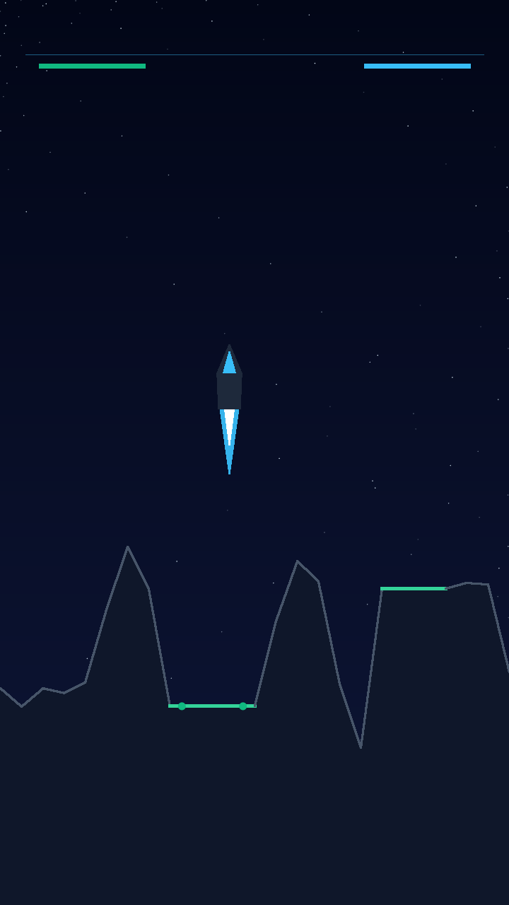

# Gravity Lander

**A physics-based lunar and cavern lander game featuring dual thrusters, heavy transport missions with rovers and trucks, vehicle logistics depots, multi-route alien worlds, and an interactive level editor.**

[](#license)
[](#)
[](#)
[](#)

---

## 🚀 Features

- **Physics-Based Landing** — Realistic gravity and thruster physics with dual-engine control
- **Heavy Transport Missions** — Land rovers and trucks across hazardous terrain
- **Vehicle Logistics Depots** — Strategic depot management for mission planning
- **Multi-Route Alien Worlds** — Explore diverse planetary environments with multiple landing paths
- **Interactive Level Editor** — Design and share custom maps
- **Procedural Generation** — Unique planetary surfaces each playthrough
- **Particle Effects & Sound** — Immersive visual and audio feedback
- **Achievements & Score Tracking** — Compete for high scores and unlock medals
- **PWA Support** — Install and play offline on desktop and mobile

---

## 🛠️ Tech Stack

| Technology | Purpose |
|------------|---------|
| **Vite** | Build tool and dev server |
| **TypeScript** | Type-safe source code |
| **React** | UI components |
| **CSS** | Styling and animations |

---

## 📦 Getting Started

### Prerequisites

- [Node.js](https://nodejs.org/) ≥ 18.x
- [Bun](https://bun.sh/) (recommended) or npm

### Installation

```bash
# Clone the repository
git clone https://github.com/mbgalego/Gravity-Lander.git
cd Gravity-Lander

# Install dependencies
bun install
# or
npm install

# Copy environment variables
cp .env.example .env
```

### Running the Development Server

```bash
# Start development server
bun dev
# or
npm run dev
```

The game will be available at `http://localhost:5173`.

### Building for Production

```bash
# Build for production
bun build
# or
npm run build
```

### Preview Production Build

```bash
bun preview
# or
npm run preview
```

---

## 📁 Project Structure

```
├── src/
│   ├── components/      # React UI components (HUD, menus, modals, editors)
│   ├── game/            # Core game logic (physics, rendering, planets, ships)
│   ├── utils/           # Utilities (achievements, storage, audio, fullscreen)
│   ├── types.ts         # TypeScript type definitions
│   ├── App.tsx          # Main application component
│   ├── main.tsx         # Application entry point
│   └── index.css        # Global styles
├── public/              # Static assets (icons, screenshots, service worker)
├── scripts/             # Build and generation scripts
├── tmp/                 # Temporary update utilities
├── .env.example         # Environment variable template
├── vite.config.ts       # Vite configuration
├── tsconfig.json        # TypeScript configuration
├── package.json         # Project manifest
└── bun.lock             # Bun lockfile
```

---

## 🎮 Game Modes

- **Story Missions** — Progress through themed planetary campaigns
- **Free Play** — Experiment with any unlocked planet
- **Map Editor** — Create custom landing sites and share them

---

## 🔧 Scripts

| Script | Description |
|--------|-------------|
| `generate-pwa-assets.js` | Generate PWA icon assets from source |
| `validate_spectre.js` | Validate Spectre ship SVG assets |
| `update_behemoth.py` | Update behemoth ship graphics |
| `update_titan_svg.cjs` | Update Titan ship SVG graphics |

---

## 📸 Screenshots




---

## 🌐 PWA Installation

Gravity Lander supports Progressive Web App features:

1. Open the game in a modern browser
2. Look for the install prompt in your browser
3. Or use the in-game install option from the settings menu
4. Play offline once installed

---

## 🤝 Contributing

Contributions are welcome! Please feel free to submit a Pull Request or open an Issue for bugs and feature requests.

1. Fork the repository
2. Create your feature branch (`git checkout -b feature/amazing-feature`)
3. Commit your changes (`git commit -m 'Add amazing feature'`)
4. Push to the branch (`git push origin feature/amazing-feature`)
5. Open a Pull Request

---

## 📝 License

This project is licensed under the MIT License — see the [LICENSE](LICENSE) file for details.

---

## 🙏 Acknowledgments

- The original Gravity Lander concept by the community
- All contributors and testers
- Open source libraries that make this possible

---

## 📄 References

- [Repository](https://github.com/mbgalego/Gravity-Lander)
- [Issues](https://github.com/mbgalego/Gravity-Lander/issues)
- [Discussions](https://github.com/mbgalego/Gravity-Lander/discussions)

---

*Made with ❤️ by the Gravity Lander community*
